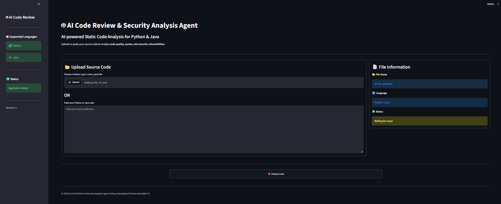
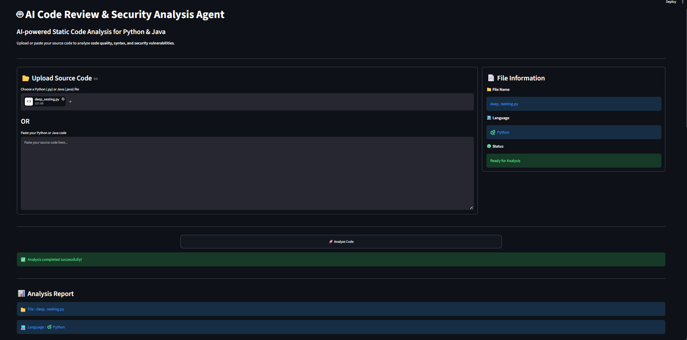
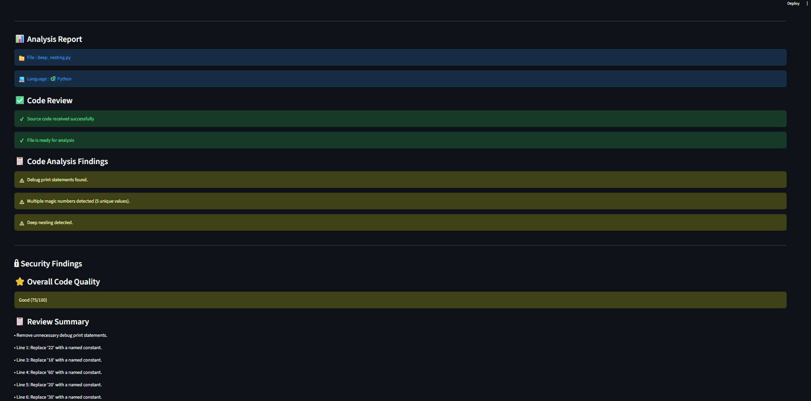
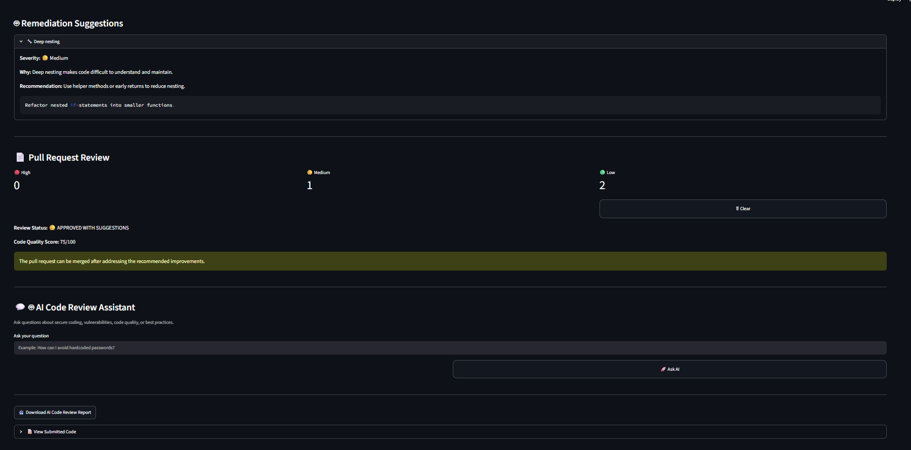
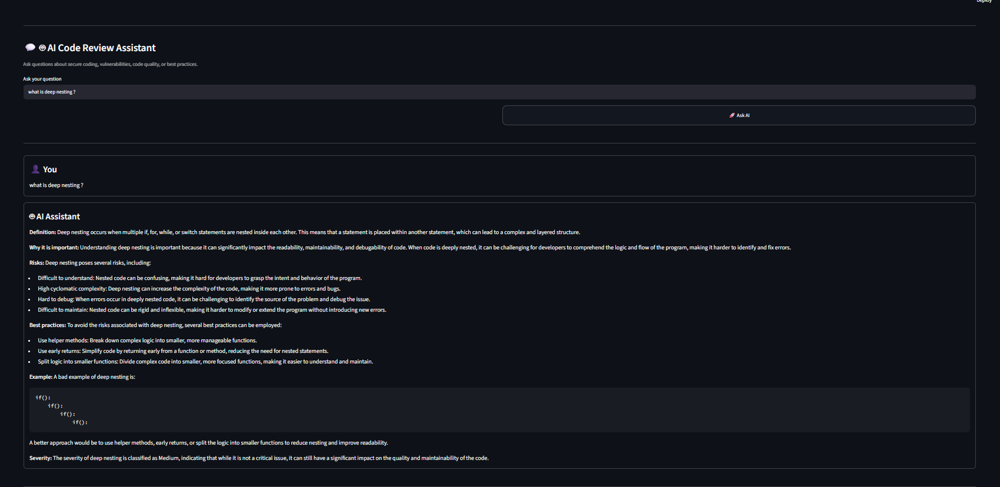

# 🤖 AI Code Review & Security Analysis Agent

An AI-powered **Multi-Agent Code Review and Security Analysis Platform** developed as part of the **Infosys Springboard Virtual Internship 7.0**.

The application automatically analyzes **Python** and **Java** source code to identify code quality issues and security vulnerabilities, provides remediation suggestions, generates pull request summaries, exports review reports, and includes a **RAG-powered AI Assistant** for secure coding guidance.

---

# 📌 Project Overview

Manual code reviews are often time-consuming, inconsistent, and unable to detect security vulnerabilities early in the software development lifecycle.

The **AI Code Review & Security Analysis Agent** automates this process through a **multi-agent architecture** where specialized agents collaborate to analyze code, detect vulnerabilities, recommend fixes, generate review summaries, and answer developer queries using a **Retrieval-Augmented Generation (RAG)** pipeline.

---

# ✨ Features

## 📂 Code Submission Module

- Upload Python (.py) and Java (.java) source files
- Paste source code directly
- Automatic language detection
- Python syntax validation

---

## 🔍 Code Analysis Agent

Detects:

- TODO comments
- Debug print statements
- Magic numbers
- Deep nesting
- Long functions
- Large source files
- Trailing whitespace
- Tabs and formatting issues

Generates an overall **Code Quality Score**.

---

## 🔒 Security Vulnerability Agent

Detects:

- Hardcoded Passwords
- API Keys
- Secrets
- Tokens
- SQL Injection patterns
- eval() usage
- exec() usage

Provides severity-based findings.

---

## 🛠 Remediation Agent

Provides:

- Severity level
- Issue explanation
- Best practice recommendation
- Corrected code examples

---

## 📄 Pull Request Summary Agent

Generates:

- High / Medium / Low issue count
- Pull Request Review Summary
- Merge recommendation
- Code Quality Score

---

## 🤖 AI Code Review Assistant

Powered by:

- Retrieval-Augmented Generation (RAG)
- FAISS Vector Database
- Groq LLM

Allows developers to ask questions related to:

- Secure coding
- Security vulnerabilities
- Code quality
- Best coding practices

---

## 📥 Report Generation

Generate downloadable reports containing:

- Code Analysis Findings
- Security Findings
- Review Summary
- Overall Code Quality Score

---

# 🛠 Technology Stack

| Category | Technologies |
|----------|--------------|
| Programming Language | Python |
| Frontend | Streamlit |
| AI Framework | LangChain |
| Embeddings | Hugging Face Sentence Transformers |
| Vector Database | FAISS |
| LLM | Groq (Llama 3.3) |
| Parsing | AST |
| Architecture | Multi-Agent + RAG |

---

# 🏗 System Architecture

```text
                    User Uploads Code
                           │
                           ▼
                Code Submission Module
                           │
                           ▼
                 Language Detection
                           │
                           ▼
                 Syntax Validation
                           │
          ┌────────────────┴─────────────────┐
          ▼                                  ▼
 Code Analysis Agent        Security Vulnerability Agent
          │                                  │
          └───────────────┬──────────────────┘
                          ▼
                 Remediation Agent
                          ▼
              Pull Request Summary Agent
                          ▼
                Report Generation Module
                          ▼
               AI Code Review Assistant
                          │
                          ▼
                 FAISS Retriever (RAG)
                          │
                          ▼
           Secure Coding Knowledge Base
                          │
                          ▼
                      Groq LLM
                          │
                          ▼
                 AI Generated Response
```

---

# 📂 Project Structure

```text
AI-Code-Review-Security-Analysis-Agent
│
├── knowledge_base/
│
├── modules/
│   ├── analysis.py
│   ├── security.py
│   ├── validator.py
│   ├── remediation.py
│   ├── report.py
│   ├── prompt_builder.py
│   └── rag_assistant.py
│
├── rag/
│   ├── loader.py
│   ├── chunker.py
│   ├── embedder.py
│   ├── retriever.py
│   └── vector_store.py
│
├── vector_db/
├── screenshots/
├── app.py
├── build_vector_db.py
├── requirements.txt
├── README.md
└── .gitignore
```

---

# 📚 Secure Coding Knowledge Base

The RAG pipeline indexes trusted secure coding resources including:

- OWASP Secure Coding Practices
- OWASP Top 10
- Oracle Java Secure Coding Guidelines
- Python Secure Coding Guidelines
- Custom Secure Coding Documents

---

# 🔄 RAG Pipeline

```text
Knowledge Base
       │
       ▼
Document Loader
       │
       ▼
Document Chunker
       │
       ▼
Embedding Generation
       │
       ▼
FAISS Vector Store
       │
       ▼
Retriever
       │
       ▼
Prompt Builder
       │
       ▼
Groq LLM
       │
       ▼
AI Response
```

---

# 🎯 Project Outcomes

- Automated static code review for Python and Java.
- Detection of code quality issues and security vulnerabilities.
- Severity-based findings with remediation suggestions.
- AI-generated Pull Request review summary.
- RAG-powered conversational AI assistant.
- Downloadable code review reports.

---

# 🚀 Installation

### Clone the repository

```bash
git clone https://github.com/adithivarda07/AI-Code-Review-Security-Analysis-Agent.git
```

### Navigate to the project

```bash
cd AI-Code-Review-Security-Analysis-Agent
```

### Install dependencies

```bash
pip install -r requirements.txt
```

### Run the application

```bash
streamlit run app.py
```

---

# 📸 Screenshots

## 🏠 Home Page



---

## 📊 Analysis Report



---

## 🔒 Security Findings



---

## 🛠 Remediation Suggestions & Pull Request Review



---

## 🤖 AI Code Review Assistant



---

# 📑 Project Documents

- 📋 [Agile Project Workbook](documents_/Agile_Template_v0.1.xls)
- ✅ [Unit Test Plan](documents_/Unit_Test_Plan_v0.1.xlsx)
- 🐞 [Defect Tracker](documents_/Defect_Tracker_Template_v0.1.xlsx)
  
---

# 👩‍💻 Developer

**Adithi Varda**


